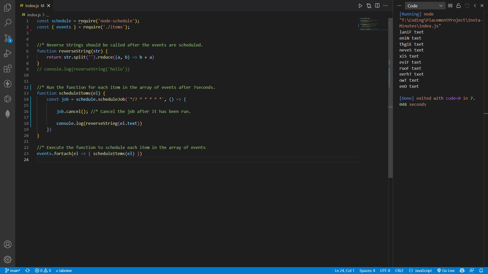

# Insta-Minutes

# Tech Stack Used

* JAVASCRIPT
* NodeJS

# Approch -:
1. From npmjs download the node-scheduler.
2. Create a file called items, which have list of events in a format of 

```yaml 

    "Event": [
       {
        text: "text One",
        dateTime: "2022-03-26 10:39:00.000",
      },
      {
        text: "text Two",
        dateTime: "2022-03-26 10:39:00.000",
      },
      {
        text: "text Three",
        dateTime: "2022-03-26 10:39:00.000",
      },
      {
        text: "text Four",
        dateTime: "2022-03-26 10:40:00.000",
      },
      {
        text: "text Five",
        dateTime: "2022-03-26 10:40:00.000",
      },
      {
        text: "text Six",
        dateTime: "2022-03-26 10:40:00.000",
      },
      {
        text: "text Seven",
        dateTime: "2022-03-26 10:41:00.000",
      },
      {
        text: "text Eight",
        dateTime: "2022-03-26 10:41:00.000",
      },
      {
        text: "text Nine",
        dateTime: "2022-03-26 10:41:00.000",
      },
      {
        text: "text Final",
        dateTime: "2022-03-26 10:41:05.000",
      },

    ]

```

# Learning-:
* Learn about new package node-scheduler and its implementation.

 # Sample output
 